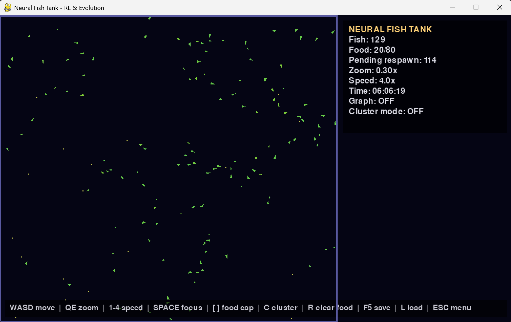
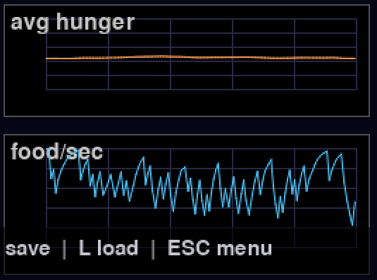

# Neural Fish Tank Simulator 🐟  
_Evolutionary neural-network fish in a 2D Pygame tank_



This project is an interactive 2D “fish tank” where every fish is controlled by its own tiny feed-forward neural network.  
The fish live in a continuous 2000×2000 world, but you only see a movable 1000×600 viewport that you can pan and zoom around.:contentReference[oaicite:1]{index=1}

There are currently **two entry points**:

- `main.py` – simpler version with a single save file and one metric graph.:contentReference[oaicite:2]{index=2}  
- `Version2.py` – enhanced version with food clustering, adjustable food cap, multiple save slots, and an extra hunger graph.  

---

## Concept

### Fish

- Live in a continuous 2D world bounded by solid tank walls (no wrap-around).  
- Each fish has:
  - Position, velocity, heading, speed.
  - Internal state: **hunger**, **age**, **energy**, and **size**.  
- Observations fed into the neural net include:
  - Direction to nearest food.
  - Current velocity.
  - Normalized hunger, age, and size.:contentReference[oaicite:6]{index=6}  
- The neural net outputs two continuous actions:
  - **Turn** (steering).
  - **Throttle** (speed up / slow down).  
- Fish start small and grow until they reach a **mature age**; larger fish pay a higher hunger cost and will die if hunger gets too high.  

### Food

- Food pellets spawn around the tank.  
- Fish must seek and eat food to reduce hunger and gain energy.  

In the enhanced version (`Version2.py`):

- You can toggle **cluster mode** so food appears in localized patches.  
- You can dynamically adjust the **maximum amount of food** in the tank.  
- You can remove all food at once and let it respawn later, to force fish to move and adapt.  

### Life cycle & evolution

- Eating food:
  - Reduces hunger.
  - Increases an internal **energy** store.:contentReference[oaicite:13]{index=13}  
- When a fish has enough energy and is old enough, it can **reproduce**:
  - Offspring inherit a clone of the parent’s neural net.
  - The child network is mutated with small Gaussian noise, creating diversity.  
- Over time, the population drifts toward policies that are better at surviving in your current food settings.:contentReference[oaicite:15]{index=15}  

If all fish die, the world automatically re-seeds a new population so the simulation keeps going.:contentReference[oaicite:16]{index=16}  

### Colors from neural networks

Each fish’s color is derived directly from the flattened weights of its neural network:

- Similar networks → similar colors.
- As networks mutate and evolve, colors slowly drift and cluster.  

This makes the tank a visual map of which policies are dominating at any moment.

---

## Start Menu

When you launch either version, you start on a **menu screen**:

- **Resume Simulation** (only if a world already exists in memory)
- **Start New Simulation**
- **Load Saved Simulation**
- **Quit**  

Use `↑ / ↓` or `W / S` to move the selection, `Enter` or `Space` to confirm.  
Press **Esc** from the menu to exit the program.

---

## Controls

### Common controls (both versions)

These controls work in both `main.py` and `Version2.py`:  

- **W / A / S / D** – Move the camera over the large world.
- **Q / E** – Zoom out / zoom in.
- **1 / 2 / 3 / 4** – Set simulation speed (0.5×, 1×, 2×, 4×).
- **SPACE** – Jump the camera to a random live fish.
- **G** – Toggle the food-consumption graph.
- **F5** – Save current simulation.
- **F9** (or **L** in Version2) – Load a saved simulation.
- **ESC** – Return to the start menu (from a running sim) or quit (from the menu).

### Extra controls in `Version2.py`

The enhanced version has additional “ecosystem control” hotkeys:  

- **[` / -** – Decrease maximum food cap.
- **] / =** – Increase maximum food cap.
- **C** – Toggle food **cluster mode** on/off.
- **R** – Remove all current food (it will respawn over time).
- **L / F9** – Open the save-file selector screen (multiple saves).  

The HUD will show:

- Current number of fish.
- Current food / food cap.
- Pending food respawns.
- Simulation time.
- Whether the consumption/hunger graph is on.
- Whether cluster mode is active.:contentReference[oaicite:22]{index=22}  

---

## Graphs & metrics



There are one or two small graphs you can overlay in the top-right corner:

- **Food consumption rate** – food eaten per simulated second over the last ~10 seconds.
- **Average hunger** (Version2 only) – average hunger across all fish, also over a recent window.  

These graphs help you see whether your ecosystem is stable, starving, or exploding in population.

---

## How it works (technical overview)

- The neural network is a small fully-connected feed-forward net:
  - Input size: 7 (direction to food, velocity, hunger, age, size).:contentReference[oaicite:24]{index=24}  
  - Hidden sizes: `[16, 16]`.
  - Output size: 2 (turn, throttle).  
- Weights are initialized with Xavier/Glorot initialization.:contentReference[oaicite:26]{index=26}  
- Hidden layers use ReLU activations; output layer uses `tanh` to keep actions in `[-1, 1]`.:contentReference[oaicite:27]{index=27}  
- Evolution:
  - When fish reproduce, the child’s network is a mutated clone of the parent.
  - Mutations are applied as Gaussian noise to randomly selected weights and biases.  

The **world** handles:

- Updating fish (physics, hunger, growth, death).  
- Simple fish–fish collision resolution so they don’t overlap too much.:contentReference[oaicite:30]{index=30}  
- Food spawning, respawning, clustering, and removal.  
- Reproduction and culling dead fish.  

Implementation details live in `main.py` and `Version2.py`.:contentReference[oaicite:33]{index=33}  

---

## Installation

**Requirements:**

- Python 3.10+ (recommended).
- `pygame`
- `numpy`  

Install dependencies:

```bash
pip install -r requirements.txt
